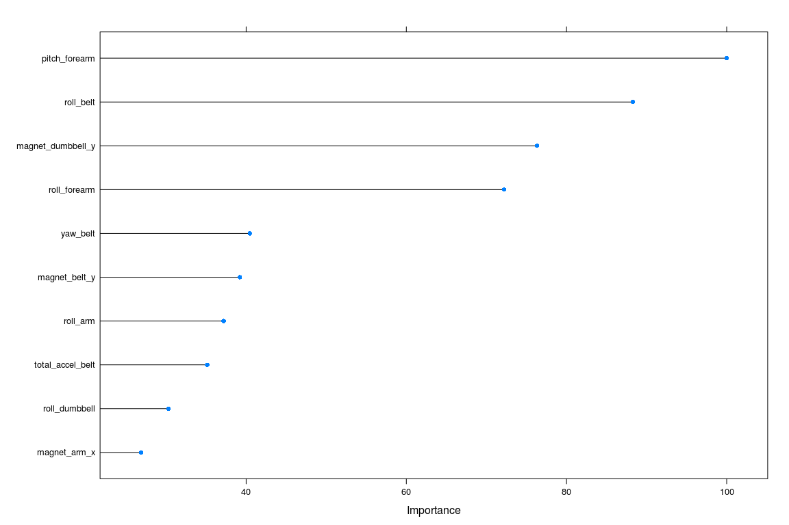
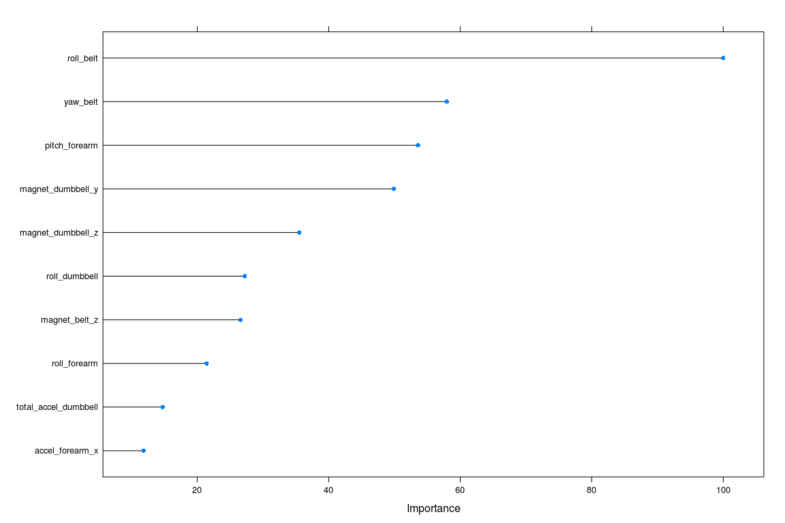
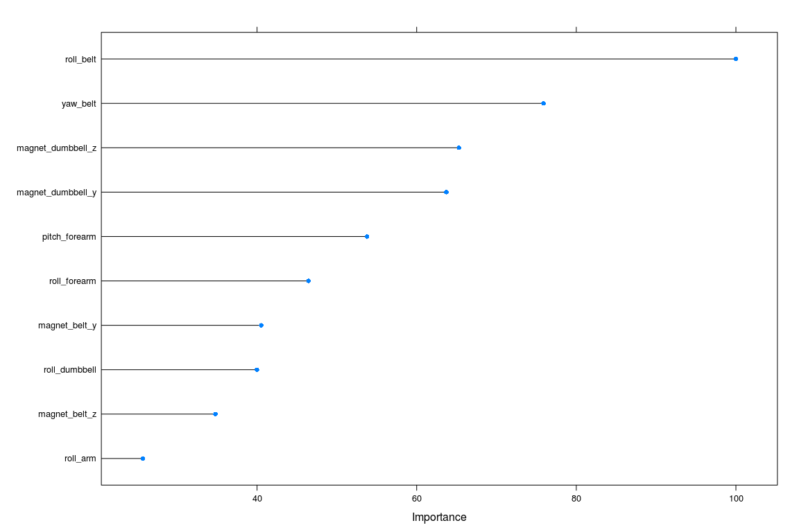

# Quantified-Self Predictions
Panos Rontogiannis  
`r Sys.Date()`  

## Introduction

> Using devices such as Jawbone Up, Nike FuelBand, and Fitbit it is now possible to collect a large amount of data about personal activity relatively inexpensively. These type of devices are part of the quantified self movement a group of enthusiasts who take measurements about themselves regularly to improve their health, to find patterns in their behavior, or because they are tech geeks. One thing that people regularly do is quantify how much of a particular activity they do, but they rarely quantify how well they do it. 

The data for this project comes from accelerometers on the belt, forearm, arm, and dumbell of 6 participants. The participants were asked to perform barbell lifts correctly and incorrectly in 5 different ways.

The goal of the project is to predict the manner in which the participants did the exercise. This is the **classe** variable in the training set. We will try to use some of the remaining variables to predict *classe* using the `caret` R package. 


## The Data

The data is loaded from two different zipped files 'pml-training.csv.gz' and 'pml-testing.csv.gz' containing the training and testing observations respectively.


```r
training_orig <- read.csv('pml-training.csv.gz')
testing_final <- read.csv('pml-testing.csv.gz')
```

Initially we have 19622 observations for training and 20 for final testing by the project evaluators. Note that this dataset does not contain the `classe` variable. For this reason we will only use this dataset at the end to create the files for the project submission. 

The training dataset has 160 variables (columns) including the response variable (`classe`). Let's split it into two more sets. Firstly the actual training dataset and secondly the testing set to be used to select the best model. This way we will be able to measure the out of sample error.


```r
set.seed(3456)
inTrain <- createDataPartition(training_orig$classe, p=0.7, list=FALSE)
training <- training_orig[inTrain,]
testing <- training_orig[-inTrain,]
```

So now we have 13737 observations for training our models and 5885 for evaluating the trained models and picking the best one.

## Exploratory Analysis

Let's explore the training dataset. First let's have a look at the response variable. It is a factor variable with 5 levels (A, B, C, D, E). As can be seen from the frequency table of the types of variable, most of the are numerical:

```r
table(sapply(colnames(training), FUN = function(n) class(training[, n])))
```

```
## 
##  factor integer numeric 
##      37      35      88
```

Let's continue by looking for missing values.


```r
complete_training <- complete.cases(training)
```

From the training data we can see that 280 out of 13737 observations are complete (no missing values at any column). Looking more closely we can see that there are columns that mostly consist of missing values.


```r
# Count missing values per column.
missing_values <- data.frame(col_name = names(training), na_count = colSums(is.na(training)), row.names = NULL)
missing_values <- subset(missing_values, na_count > 0)

qplot(missing_values$na_count, xlab = '# of NA', ylab = '# of variables', main = 'Exploring missing values', binwidth = 1)
```

 

```r
# Remove columns with missing values.
training_no_na <- training[, !(names(training) %in% missing_values$col_name)]
```

After removing those 67 columns we are left with 93.

Next let's see if there are any variables with near zero variance.


```r
nzv <- nearZeroVar(training_no_na)
# Remove columns with near zero variance.
training_no_na_nzv <- training_no_na[, -nzv]
```

After removing those 34 columns we are left with 59.

Now let's look for high correlations between the remainder variables.


```r
# Need to remove factor variables first for the cor function to work.
no_factors <- c()
for (f in colnames(training_no_na_nzv)) {
    if (!is.factor(training_no_na_nzv[, f]))
        no_factors <- c(no_factors, f)
}
cor_training <- cor(training_no_na_nzv[, no_factors])
# find highly correlated descriptors
corrDescr <- findCorrelation(cor_training, cutoff = 0.75)
# remove them from training set
training_no_na_nzv_cor <- training_no_na_nzv[, -corrDescr]
```

After removing those 22 columns we are left with 37. These are: *accel_arm_y, accel_forearm_x, accel_forearm_y, accel_forearm_z, classe, gyros_arm_x, gyros_belt_x, gyros_dumbbell_x, gyros_forearm_y, magnet_arm_x, magnet_arm_y, magnet_arm_z, magnet_belt_x, magnet_belt_y, magnet_belt_z, magnet_dumbbell_y, magnet_dumbbell_z, magnet_forearm_x, magnet_forearm_y, magnet_forearm_z, num_window, pitch_arm, pitch_dumbbell, pitch_forearm, raw_timestamp_part_1, raw_timestamp_part_2, roll_arm, roll_belt, roll_dumbbell, roll_forearm, total_accel_belt, total_accel_dumbbell, user_name, X, yaw_arm, yaw_belt, yaw_forearm*.

We can see that there are two time-stamp variables, a factor variable called *user_name*, a variable *X* which is simply the row number and finally *num_window*. Let's remove them since they are irrelevant.


```r
training_no_na_nzv_cor <- training_no_na_nzv_cor[, !(names(training_no_na_nzv_cor) %in% c('raw_timestamp_part_1', 'raw_timestamp_part_2', 'user_name', 'X', 'num_window'))]
```

The final dataset before we start training has 32 columns (including the response variables). These are *accel_arm_y, accel_forearm_x, accel_forearm_y, accel_forearm_z, classe, gyros_arm_x, gyros_belt_x, gyros_dumbbell_x, gyros_forearm_y, magnet_arm_x, magnet_arm_y, magnet_arm_z, magnet_belt_x, magnet_belt_y, magnet_belt_z, magnet_dumbbell_y, magnet_dumbbell_z, magnet_forearm_x, magnet_forearm_y, magnet_forearm_z, pitch_arm, pitch_dumbbell, pitch_forearm, roll_arm, roll_belt, roll_dumbbell, roll_forearm, total_accel_belt, total_accel_dumbbell, yaw_arm, yaw_belt, yaw_forearm*.

After all this pre-processing, the frequency table of variable types has become:

```r
table(sapply(colnames(training_no_na_nzv_cor), FUN = function(n) class(training_no_na_nzv_cor[, n])))
```

```
## 
##  factor integer numeric 
##       1      14      17
```

## Training


Because `classe` is a *factor* variable we will need to train a classifier and since it has more than two levels, we cannot use *Generalized Linear Models* (glm). Instead we have to use more advanced classifiers. More specifically *classification and regression trees (CART)*, *stochastic gradient boosting* and *random forest*. All classifiers will be trained using *5-fold Cross Validation* to reduce model overfitting and to estimate the out of sample error during training. We expect this estimate to be close to the final out of sample error that we will calculate later on using the test dataset. Our metric will be *accuracy*.


```r
trControl <- trainControl(method="cv", number=5)
```

Let's train the classifiers, print a summary for each model and plot the most important features:

### 1. CART (rpart)


```r
m_no_na_nzv_cor_rpart <- train(classe ~ ., data = training_no_na_nzv_cor, method='rpart', trControl = trControl)

m_no_na_nzv_cor_rpart$results[1,]
```

```
##           cp  Accuracy    Kappa AccuracySD    KappaSD
## 1 0.03478792 0.5202717 0.379566 0.03763233 0.05712338
```

### 2. Boosting (gbm)

For boosting, the maximum depth of interactions is set to 40, the number of trees to 150 with learning rate of 0.01.


```r
gbmParam <-  expand.grid(interaction.depth = 40, n.trees = 150, shrinkage = .01, n.minobsinnode = 10)
m_no_na_nzv_cor_gbm <- train(classe ~ ., data = training_no_na_nzv_cor, trControl = trControl, tuneGrid = gbmParam, method='gbm', distribution = 'multinomial', verbose=FALSE)

m_no_na_nzv_cor_gbm$results
```

```
##   interaction.depth n.trees shrinkage n.minobsinnode  Accuracy     Kappa
## 1                40     150      0.01             10 0.9727748 0.9655547
##    AccuracySD    KappaSD
## 1 0.002519908 0.00318668
```

The estimated accuracy of this model is quite high. With more fine tuning it could probably get even higher.

### 3. Random Forest (parRF). 

For the training of the random forest classifier, `mtry` is set to 2 and `proximity` to TRUE.


```r
rfParam <- expand.grid(mtry = 2)
m_no_na_nzv_cor_rf <- train(classe ~ ., data = training_no_na_nzv_cor, method='parRF', prox=TRUE, tuneGrid = rfParam, trControl = trControl)

m_no_na_nzv_cor_rf$results
```

```
##   mtry  Accuracy     Kappa AccuracySD KappaSD
## 1    2 0.9883509 0.9852619         NA      NA
```

## Results

First let's compare all models using the resamples function:


```r
resamps <- resamples(list(RPART = m_no_na_nzv_cor_rpart, RF = m_no_na_nzv_cor_rf, GBM = m_no_na_nzv_cor_gbm))
summary(resamps)
```

```
## 
## Call:
## summary.resamples(object = resamps)
## 
## Models: RPART, RF, GBM 
## Number of resamples: 5 
## 
## Accuracy 
##         Min. 1st Qu. Median   Mean 3rd Qu.   Max. NA's
## RPART 0.4924  0.4949 0.4982 0.5203  0.5366 0.5793    0
## RF    0.9884  0.9884 0.9884 0.9884  0.9884 0.9884    4
## GBM   0.9705  0.9716 0.9720 0.9728  0.9727 0.9771    0
## 
## Kappa 
##         Min. 1st Qu. Median   Mean 3rd Qu.   Max. NA's
## RPART 0.3349  0.3396 0.3445 0.3796  0.4166 0.4624    0
## RF    0.9853  0.9853 0.9853 0.9853  0.9853 0.9853    4
## GBM   0.9627  0.9641 0.9646 0.9656  0.9654 0.9710    0
```

We can see that the random forest is the most accurate model followed by boosting and CART. We can also use the testing dataset (taken from the original training set) to see how the three models perform compared to the actual values of the response variable *classe*:

### 1. CART (rpart)

```r
pred_rpart <- predict(m_no_na_nzv_cor_rpart, testing)
cm_rpart <- confusionMatrix(pred_rpart, testing$classe)
cm_rpart
```

```
## Confusion Matrix and Statistics
## 
##           Reference
## Prediction    A    B    C    D    E
##          A 1505  458  474  418  155
##          B   32  393   31  188  147
##          C  133  288  521  358  306
##          D    0    0    0    0    0
##          E    4    0    0    0  474
## 
## Overall Statistics
##                                           
##                Accuracy : 0.4916          
##                  95% CI : (0.4787, 0.5044)
##     No Information Rate : 0.2845          
##     P-Value [Acc > NIR] : < 2.2e-16       
##                                           
##                   Kappa : 0.3363          
##  Mcnemar's Test P-Value : NA              
## 
## Statistics by Class:
## 
##                      Class: A Class: B Class: C Class: D Class: E
## Sensitivity            0.8990  0.34504  0.50780   0.0000  0.43808
## Specificity            0.6426  0.91614  0.77670   1.0000  0.99917
## Pos Pred Value         0.5000  0.49684  0.32441      NaN  0.99163
## Neg Pred Value         0.9412  0.85355  0.88198   0.8362  0.88755
## Prevalence             0.2845  0.19354  0.17434   0.1638  0.18386
## Detection Rate         0.2557  0.06678  0.08853   0.0000  0.08054
## Detection Prevalence   0.5115  0.13441  0.27290   0.0000  0.08122
## Balanced Accuracy      0.7708  0.63059  0.64225   0.5000  0.71862
```

We can see that the out of sample error measured by accuracy is 0.4915888. During training, this was estimated to be 0.5202717. This classifier does not perform well.

### 2. Boosting (gbm)

```r
pred_gbm <- predict(m_no_na_nzv_cor_gbm, testing)
cm_gbm <- confusionMatrix(pred_gbm, testing$classe)
cm_gbm
```

```
## Confusion Matrix and Statistics
## 
##           Reference
## Prediction    A    B    C    D    E
##          A 1662   21    0    0    0
##          B    3 1099   20    0    3
##          C    6   18  994   26    5
##          D    0    1   12  938    9
##          E    3    0    0    0 1065
## 
## Overall Statistics
##                                          
##                Accuracy : 0.9784         
##                  95% CI : (0.9744, 0.982)
##     No Information Rate : 0.2845         
##     P-Value [Acc > NIR] : < 2.2e-16      
##                                          
##                   Kappa : 0.9727         
##  Mcnemar's Test P-Value : NA             
## 
## Statistics by Class:
## 
##                      Class: A Class: B Class: C Class: D Class: E
## Sensitivity            0.9928   0.9649   0.9688   0.9730   0.9843
## Specificity            0.9950   0.9945   0.9887   0.9955   0.9994
## Pos Pred Value         0.9875   0.9769   0.9476   0.9771   0.9972
## Neg Pred Value         0.9971   0.9916   0.9934   0.9947   0.9965
## Prevalence             0.2845   0.1935   0.1743   0.1638   0.1839
## Detection Rate         0.2824   0.1867   0.1689   0.1594   0.1810
## Detection Prevalence   0.2860   0.1912   0.1782   0.1631   0.1815
## Balanced Accuracy      0.9939   0.9797   0.9787   0.9843   0.9918
```

The accuracy of this model against the testing data is 0.9784197. During training, this was estimated to be 0.9727748.

### 3. Random Forest (rf)

```r
pred_rf <- predict(m_no_na_nzv_cor_rf, testing)
cm_rf <- confusionMatrix(pred_rf, testing$classe)
cm_rf
```

```
## Confusion Matrix and Statistics
## 
##           Reference
## Prediction    A    B    C    D    E
##          A 1674    5    0    0    0
##          B    0 1134    3    0    0
##          C    0    0 1019   16    2
##          D    0    0    4  948    3
##          E    0    0    0    0 1077
## 
## Overall Statistics
##                                           
##                Accuracy : 0.9944          
##                  95% CI : (0.9921, 0.9961)
##     No Information Rate : 0.2845          
##     P-Value [Acc > NIR] : < 2.2e-16       
##                                           
##                   Kappa : 0.9929          
##  Mcnemar's Test P-Value : NA              
## 
## Statistics by Class:
## 
##                      Class: A Class: B Class: C Class: D Class: E
## Sensitivity            1.0000   0.9956   0.9932   0.9834   0.9954
## Specificity            0.9988   0.9994   0.9963   0.9986   1.0000
## Pos Pred Value         0.9970   0.9974   0.9826   0.9927   1.0000
## Neg Pred Value         1.0000   0.9989   0.9986   0.9968   0.9990
## Prevalence             0.2845   0.1935   0.1743   0.1638   0.1839
## Detection Rate         0.2845   0.1927   0.1732   0.1611   0.1830
## Detection Prevalence   0.2853   0.1932   0.1762   0.1623   0.1830
## Balanced Accuracy      0.9994   0.9975   0.9947   0.9910   0.9977
```

In this case accuracy is 0.9943925. During training, this was estimated to be 0.9883509. From the table we see that almost all observations were correctly predicted. There just a few misclassifications. Overall this classifier performed exceptionally well outperforming the other two classifiers.

## Summary

To summarize we used the *caret* R package to split the data into two datasets for training and testing. We then preprocessed the training dataset using several techniques (missing values, near zero values, linear correlations) and managed to reduce the number of variables from 160 to 32. Then we trained three different classifiers using the *CART*, *Random Forest* and *Boosting* methods. 5-fold Cross Validation was used to validate each model and avoid overfitting. From these three classifiers, the one based on *random forests* performed significantly better with accuracy close to 99% on the test dataset.

## References

The data for this project come from this [source](http://groupware.les.inf.puc-rio.br/har) (see the section on the Weight Lifting Exercise Dataset).

Velloso, E.; Bulling, A.; Gellersen, H.; Ugulino, W.; Fuks, H. [Qualitative Activity Recognition of Weight Lifting Exercises](http://groupware.les.inf.puc-rio.br/work.jsf?p1=11201). Proceedings of 4th International Conference in Cooperation with SIGCHI (Augmented Human '13) . Stuttgart, Germany: ACM SIGCHI, 2013. 

## Appendix A: Training times

To train in parallel the `doMC` package was used with 2 workers. The total time (in seconds) needed to train each method is:  
1. CART: 14.792  
2. Boosting: 1019.616  
3. Random Forest: 618.488  

## Appendix B: Selected features

### 1. CART


```r
plot(varImp(m_no_na_nzv_cor_rpart), top = 10)
```

 

### 2. Boosting


```r
plot(varImp(m_no_na_nzv_cor_gbm), top = 10)
```

 

### 3. Random Forest


```r
plot(varImp(m_no_na_nzv_cor_rf), top = 10)
```

 

## Appendix C: Submission dataset

For the project submission, the following code was used to create the separate files for each of the 20 test observations:

```r
pml_write_files = function(x){
    n = length(x)
    for(i in 1:n){
        filename = paste0("problem_id_",i,".txt")
        write.table(x[i],file=filename,quote=FALSE,row.names=FALSE,col.names=FALSE)
    }
}

final_pred_rpart <- predict(m_no_na_nzv_cor_rpart, testing_final)
final_pred_gbm <- predict(m_no_na_nzv_cor_gbm, testing_final)
final_pred_rf <- predict(m_no_na_nzv_cor_rf, testing_final)

data.frame(RF = final_pred_rf, GBM = final_pred_gbm, CART = final_pred_rpart)
```

```
##    RF GBM CART
## 1   B   B    C
## 2   A   A    A
## 3   B   B    C
## 4   A   A    A
## 5   A   A    A
## 6   E   E    C
## 7   D   D    C
## 8   B   B    A
## 9   A   A    A
## 10  A   A    A
## 11  B   B    C
## 12  C   C    C
## 13  B   B    C
## 14  A   A    A
## 15  E   E    C
## 16  E   E    A
## 17  A   A    A
## 18  B   B    A
## 19  B   B    A
## 20  B   B    C
```

## Appendix D: Session Info

Session Info:  

```
## R version 3.1.2 (2014-10-31)
## Platform: x86_64-pc-linux-gnu (64-bit)
## 
## locale:
##  [1] LC_CTYPE=en_US.UTF-8       LC_NUMERIC=C              
##  [3] LC_TIME=en_US.UTF-8        LC_COLLATE=en_US.UTF-8    
##  [5] LC_MONETARY=en_US.UTF-8    LC_MESSAGES=en_US.UTF-8   
##  [7] LC_PAPER=en_US.UTF-8       LC_NAME=C                 
##  [9] LC_ADDRESS=C               LC_TELEPHONE=C            
## [11] LC_MEASUREMENT=en_US.UTF-8 LC_IDENTIFICATION=C       
## 
## attached base packages:
## [1] splines   parallel  stats     graphics  grDevices utils     datasets 
## [8] methods   base     
## 
## other attached packages:
##  [1] randomForest_4.6-10 plyr_1.8.2          gbm_2.1.1          
##  [4] survival_2.37-7     rpart_4.1-9         doMC_1.3.3         
##  [7] iterators_1.0.7     foreach_1.4.2       caret_6.0-47       
## [10] ggplot2_1.0.1       lattice_0.20-29    
## 
## loaded via a namespace (and not attached):
##  [1] BradleyTerry2_1.0-6 brglm_0.5-9         car_2.0-25         
##  [4] class_7.3-12        codetools_0.2-10    colorspace_1.2-6   
##  [7] compiler_3.1.2      digest_0.6.8        e1071_1.6-4        
## [10] evaluate_0.7        formatR_1.2         grid_3.1.2         
## [13] gtable_0.1.2        gtools_3.4.2        htmltools_0.2.6    
## [16] knitr_1.10          labeling_0.3        lme4_1.1-7         
## [19] MASS_7.3-37         Matrix_1.1-5        mgcv_1.8-4         
## [22] minqa_1.2.4         munsell_0.4.2       nlme_3.1-119       
## [25] nloptr_1.0.4        nnet_7.3-9          pbkrtest_0.4-2     
## [28] proto_0.3-10        quantreg_5.11       Rcpp_0.11.5        
## [31] reshape2_1.4.1      rmarkdown_0.3.10    scales_0.2.4       
## [34] SparseM_1.6         stringr_0.6.2       tools_3.1.2        
## [37] yaml_2.1.13
```
